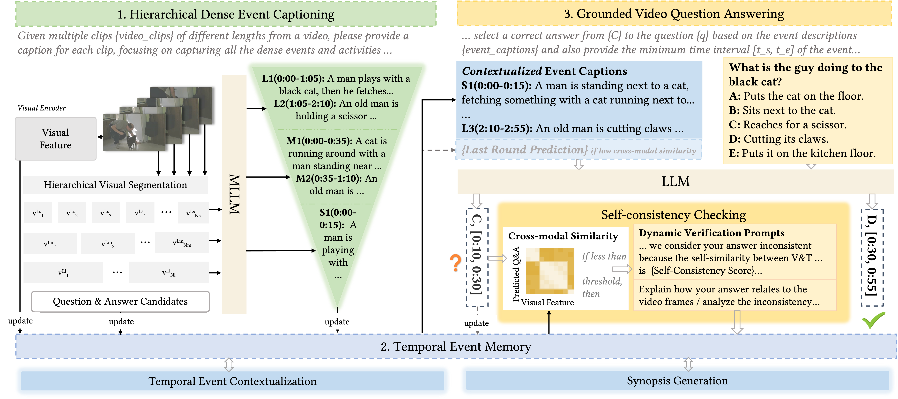

# Question-Answering Dense Video Events
Accepted to SIGIR'25
 

  

## Introduction
This paper presents question-answering on dense video events, a novel task that answers and grounds dense-event questions in long videos, thus challenging MLLMs to faithfully comprehend and reason about multiple events over extended periods of time. To facilitate the study, we construct DeVE-QA -- a dataset featuring 78K questions about 26K events on 10.6K long videos. Our benchmarking shows that state-of-the-art MLLMs struggle on DeVE-QA. For improvement, we propose DeVi, a novel training-free MLLM approach that highlights a hierarchical captioning module, a temporal event memory module, and a self-consistency checking module to respectively detect, contextualize and memorize, and ground dense-events in long videos for question answering. Extensive experiments show that DeVi is superior at answering dense-event questions and grounding relevant video moments. Compared with existing MLLMs, it achieves a remarkable increase of 4.8% and 2.1% for G(round)QA accuracy on DeVE-QA and NExT-GQA, respectively. 

  

DeVi framework: (1) Hierarchical dense event video segmenting and captioning, (2) contextualizing and memorizing events in temporal event memory, and (3) event-grounded video question answering with self-consistency checking.

## Result Analysis

  

Prediction visualization on DeVE-QA. Baseline models like SeViLA and Temp[CLIP] tend to answer the question
without truly grounding it to the relevant video segments. Hierarchical Dense Captioning (HDC) helps DeVi understand the
events in different scales, Temporal Contextualizing (TC) helps improve GQA by refining or correcting the isolated captions
according to related context, and Self-consistency checking (SC) is effective in correcting wrongly grounded segments.

## Dataset Example

  

